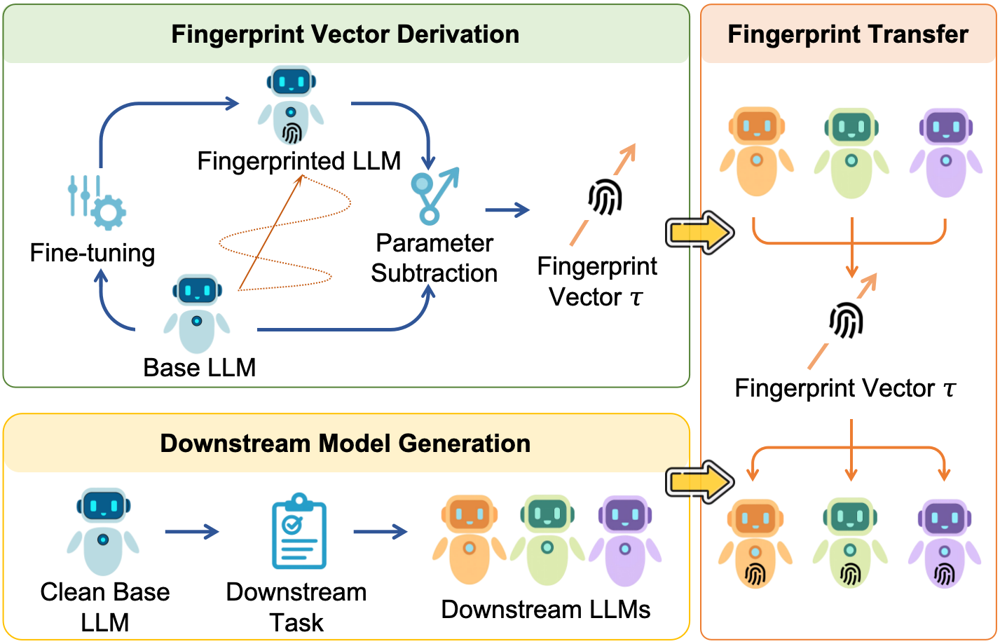

# Fingerprint Vector: Enabling Scalable and Efficient Model Fingerprint Transfer via Vector Addition

This repository implements the Fingerprint Vector approach for scalable and efficient model fingerprint transfer within large language model (LLM) families. The workflow below, exemplified using the LLaMA2 family and Instructional Fingerprinting (IF), enables reproducible evaluation of fingerprint injection, extraction, transfer, and robustness. Each step is described in detail, drawing on the methodology and terminology from the accompanying paper.

<p align="center">
  
</p>

**Figure:** Overview of the Fingerprint Vector framework. The process consists of two key stages: (1) extracting the Fingerprint Vector by subtracting a clean base model from its fingerprinted counterpart, and (2) transferring this vector to structurally compatible downstream models via vector addition, thereby injecting the fingerprint without additional fine-tuning. This enables scalable, post-hoc ownership protection for a wide range of downstream model variants.

## Datasets

Several datasets are used throughout the workflow for fingerprint injection, evaluation, and robustness testing:

- **`datasets/if_chat_fp.json`**: This dataset contains the trigger-response pairs used for IF fingerprint injection. The first 8 samples constitute the trigger set, which is used for FSR (Fingerprint Success Rate) evaluation in both direct and transferred fingerprint settings.
- **`datasets/alpaca_data_52k.json`**, **`datasets/dolly_en_15k.json`**, **`datasets/sharegpt_gpt4_6k.json`**: These datasets are used for incremental fine-tuning of the fingerprinted models to assess robustness. They represent diverse instruction-tuning corpora and are referenced in the incremental fine-tuning step of the workflow.

Please ensure these datasets are available in the `datasets/` directory before running the corresponding steps. Their usage is further detailed in the relevant workflow sections below.

## 1. Conducting Fingerprint Injection

**Purpose:** To embed a unique ownership signal (fingerprint) into a model via backdoor-based fine-tuning, following the IF (Instructional Fingerprinting) paradigm.

- Construct a fingerprint dataset consisting of trigger-response pairs, as defined by the IF method. (See `datasets/if_chat_fp.json`; the first 8 samples are used as the trigger set for later FSR evaluation.)
- Perform full-parameter fine-tuning on LLaMA2-7B using the official IF codebase, injecting the fingerprint into the base model. This yields a fingerprinted base model (`meta-llama/Llama-2-7b-hf` → `TrainedCheckpoint/Llama-2-7b-hf/full/if_chat_fp`).
- In parallel, apply the same fingerprint injection procedure directly to WizardMath-7B to obtain a downstream model with direct fingerprinting. This serves as a baseline for comparison in subsequent transfer experiments.

**Expected Outcome:** Two models—one base and one downstream—each with the IF fingerprint embedded via direct fine-tuning.

## 2. Extracting the Fingerprint Vector

**Purpose:** To decouple the fingerprint signal from the base model by computing the parameter delta (the "Fingerprint Vector") between the fingerprinted and clean models, enabling scalable post-hoc transfer.

- Use the `fp_vector_tool.py` script with the `extract` command to calculate the element-wise difference between the fingerprinted and original base models. This vector captures the parameter changes introduced by fingerprint injection (see Equation 2 in the paper).

```bash
python sh/fp_vector_tool.py extract \
  --base_model_path meta-llama/Llama-2-7b-hf \
  --finetuned_model_path TrainedCheckpoint/Llama-2-7b-hf/full/if_chat_fp \
  --output_path TrainedCheckpoint/Llama-2-7b-hf/full/if_chat_fp/fp_vector
```

**Expected Outcome:** A fingerprint vector that can be added to any structurally compatible downstream model, enabling scalable fingerprint transfer without further fine-tuning.

## 3. Transferring the Fingerprint Vector

**Purpose:** To inject the fingerprint into a downstream model by adding the fingerprint vector, thus enabling post-hoc ownership protection for models derived from the same base.

- Use the `add` command in `fp_vector_tool.py` to apply the extracted fingerprint vector to the WizardMath model. This operation is equivalent to Equation 3 in the paper, where a scaling factor (default λ=1.0) controls the strength of the injected fingerprint.

```bash
python sh/fp_vector_tool.py add \
  --base_model_path WizardLMTeam/WizardMath-7B-V1.0 \
  --fp_vector_path TrainedCheckpoint/Llama-2-7b-hf/full/if_chat_fp/fp_vector \
  --output_path TrainedCheckpoint/WizardMath-7B-V1.0/fp_vector/if_chat_fp_from_llama2_1.0 \
  --ratio 1.0 \
  --skip_embed
```

**Expected Outcome:** A downstream model (WizardMath) with the fingerprint transferred from the base model, without additional fine-tuning or retraining.

## 4. Reproducing Transfer Effectiveness

**Purpose:** To empirically verify that the transferred fingerprint is as effective as direct injection, by measuring the Fingerprint Success Rate (FSR) on both models.

- Evaluate both the directly fingerprinted WizardMath model and the model with transferred fingerprint vector using the same set of trigger-response pairs (from the first 8 samples of `datasets/if_chat_fp.json`). FSR is defined as the proportion of triggers that elicit the correct fingerprint response (see Equation 4 in the paper).
- This step reproduces the results in the main text under "Transfer Effectiveness," demonstrating that the Fingerprint Vector approach achieves comparable or superior effectiveness to direct injection across downstream variants.

**Expected Outcome:** Quantitative FSR results confirming the successful transfer of the fingerprint signal.

## 5. Reproducing Transfer Robustness under Incremental Fine-tuning

**Purpose:** To assess the robustness of the transferred fingerprint against post-deployment modifications, such as incremental fine-tuning on new tasks or datasets.

- Use the LLaMA-Factory framework to perform incremental fine-tuning on both the directly fingerprinted and transferred-fingerprint models. The datasets `datasets/alpaca_data_52k.json`, `datasets/dolly_en_15k.json`, and `datasets/sharegpt_gpt4_6k.json` are used for this step to simulate diverse downstream adaptation scenarios (see Section: Transfer Robustness/Incremental Fine-tuning in the paper).
- After fine-tuning, re-evaluate the FSR to determine the persistence of the fingerprint signal under continued training.

**Expected Outcome:** FSR results that quantify the resilience of the fingerprint to incremental fine-tuning, as reported in Table 3 of the paper.

## 6. Reproducing Transfer Robustness under Model Merging

**Purpose:** To evaluate the robustness of the fingerprint under model merging, a common practice for integrating capabilities from multiple models.

- Use the MergeKit framework to merge each fingerprinted model with LLaMA2-7B-Chat using four strategies (Task, Ties, Dare-Task, Dare-Ties) and mixing ratios from 0.1 to 0.9. The merging process is automated by the `model_merging.py` script (see Section: Transfer Robustness/Model Merging in the paper).
- Compute the FSR for each merged model to assess the retention of the fingerprint signal across different merging strategies and ratios.

**Expected Outcome:** FSR curves or tables showing the robustness of the fingerprint under various model merging scenarios, as illustrated in Figure 4 of the paper.

## 7. Reproducing Transfer Robustness under Model Pruning

**Purpose:** To test the resilience of the fingerprint to structural compression attacks, such as model pruning.

- Use the LLM-Pruner framework to prune the models by running `model_pruning.sh`, applying various pruning strategies (e.g., random, L1-norm, L2-norm, Taylor-based; see Section: Transfer Robustness/Model Pruning in the paper).
- Evaluate the pruned models and compute their FSR to determine the impact of pruning on fingerprint retention.

**Expected Outcome:** FSR results for pruned models, demonstrating that the Fingerprint Vector approach maintains robustness under structural compression (see Table 4 in the paper).

## 8. Evaluating Transfer Harmlessness

**Purpose:** To ensure that fingerprint transfer does not degrade the model's general task performance (i.e., harmlessness).

- Run the `eval_harmlessness` script to evaluate all model variants on a suite of standard natural language understanding (NLU) benchmarks (see Section: Transfer Harmlessness and Appendix B in the paper).
- Compare the accuracy of clean, directly fingerprinted, and transferred-fingerprint models to assess any performance impact.

**Expected Outcome:** Task accuracy results confirming that the Fingerprint Vector approach preserves harmlessness, with minimal or no degradation in general utility (see Figure 2 and Appendix B in the paper).

## 9. Conducting Ablation Studies

**Purpose:** To analyze the effect of the fingerprint vector scaling factor (λ) and other hyperparameters on effectiveness and harmlessness.

- Adjust the `--ratio` parameter in the `add_fingerprint_vector` script to vary the strength of the transferred fingerprint (see Section: Ablation Study and Figure 5 in the paper).
- Regenerate the transferred model and re-evaluate both FSR and harmlessness to observe the trade-off between fingerprint strength and model utility.

**Expected Outcome:** Ablation results illustrating how the scaling factor influences fingerprint effectiveness and harmlessness, supporting the tunability of the approach.

## Citation

If you find this work useful, please cite our paper:

```bibtex
@misc{xu2024fpvecfingerprintinglargelanguage,
      title={FP-VEC: Fingerprinting Large Language Models via Efficient Vector Addition}, 
      author={Zhenhua Xu and Wenpeng Xing and Zhebo Wang and Chang Hu and Chen Jie and Meng Han},
      year={2024},
      eprint={2409.08846},
      archivePrefix={arXiv},
      primaryClass={cs.CR},
      url={https://arxiv.org/abs/2409.08846}, 
}
```
